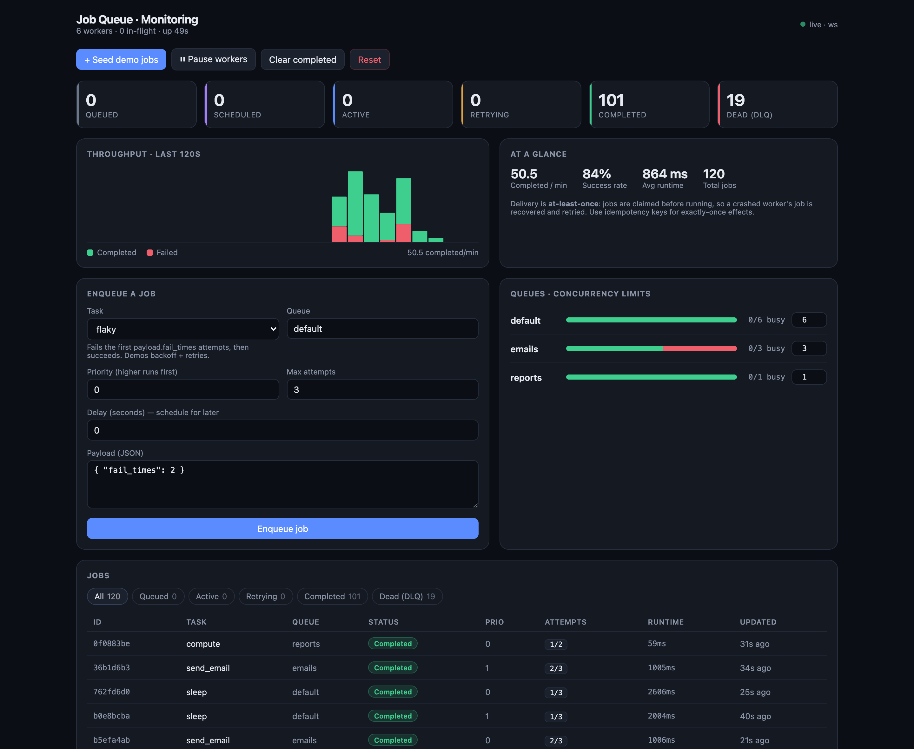

# Job Queue + Monitoring UI

A Sidekiq/Celery-style background job system with a live monitoring dashboard —
built with **Python (FastAPI)** and **React (Vite + TypeScript)**. Self-contained:
the queue is backed by SQLite and an in-process worker pool, so it runs with just
`python` and `npm` — no Redis or external broker required.

  



## Features

- **Enqueue via API**, workers pull and process concurrently.
- **Retries with exponential backoff + full jitter** and a configurable max-attempts cap.
- **Dead-letter queue (DLQ)** for jobs that exhaust their retries — inspectable and re-drivable from the UI.
- **Scheduled / delayed jobs** (`delay_seconds`).
- **Priority queues** — higher priority runs first.
- **Per-queue concurrency limits** — throttle one queue without starving the others; adjustable live from the dashboard.
- **Graceful shutdown** — draining in-flight jobs on SIGTERM; interrupted jobs are recovered on restart.
- **Idempotency keys** — de-duplicate enqueues for at-least-once → effectively-once semantics.
- **Live dashboard** — queued / active / retrying / completed / dead counts, throughput chart, success rate, avg runtime, per-job detail, and worker pause/resume.
- **WebSocket live feed** — the dashboard subscribes to `/api/ws` and receives a fresh snapshot on every state change (no polling), with automatic reconnect and a REST-polling fallback.

## Architecture

```
  React dashboard              FastAPI process (app/main.py)
  ┌───────────────┐            ┌──────────────────────────────────────────┐
  │               │  REST      │  API routes ──┐                          │
  │  actions ─────┼──────────▶ │               ▼                          │
  │               │            │        SQLite (jobs table, WAL) ◀────┐   │
  │  live feed ◀──┼── WS ──────┤  Hub (app/hub.py)          ▲         │   │
  │               │            │   ▲ broadcaster task       │         │   │
  └───────────────┘            │   │                        │         │   │
                               │  notify()  WorkerPool (app/worker.py)│   │
                               │  (thread-  ├─ worker ─ claim ─ run ──┘   │
                               │   safe)    └─ … N threads (limited)      │
                               └──────────────────────────────────────────┘
```

The API and the workers share nothing but the database, which keeps the design
simple and the workers trivially observable. `claim_next` is the only operation
that needs cross-thread coordination; it takes a process-wide lock and does an
atomic `UPDATE … WHERE status = ?` so two workers can never grab the same job.

### Live feed (WebSocket)

The dashboard connects to `/api/ws` and renders whatever the server pushes — it
never polls (with one fallback caveat below). Because workers run in plain threads
*outside* the asyncio event loop, they can't touch WebSocket connections directly.
Instead, any state change calls a thread-safe `notify()` that flips an
`asyncio.Event` via `loop.call_soon_threadsafe`. A single **broadcaster task** in
the event loop wakes on that event, builds one snapshot, and fans it out to all
connected clients:

- **Debounced** (~120 ms) so a burst of jobs finishing at once coalesces into a single push.
- A **1 s periodic tick** also fires, so purely time-based changes (a scheduled job
  coming due, the throughput window sliding) stay live even when nothing transitions.
- Each client sends `{"type":"filter","status":…}` to scope its job list; the shared
  parts of the snapshot (stats, queues, workers) are computed once per broadcast and
  only the per-client job list is recomputed.

Every mutation — enqueue, retry, delete, purge, pause/resume, concurrency change,
seed, reset — and every worker transition (claim → active, complete, fail) triggers
a push, so the UI reflects changes within ~150 ms.

The client (`src/useLive.ts`) auto-reconnects with backoff. If the socket can't be
established after a couple of attempts, it transparently **falls back to REST
polling** so the dashboard keeps working; the header shows `live · ws`,
`live · poll`, or `disconnected` accordingly.

A snapshot frame looks like:

```jsonc
{
  "type": "snapshot",
  "stats":   { "counts": { "queued": 146, "active": 5, … }, "series": [ … ], … },
  "jobs":    [ { "id": "…", "task": "flaky", "status": "active", … } ],
  "queues":  [ { "name": "default", "concurrency": 6, "counts": { … } } ],
  "workers": { "num_workers": 6, "inflight": 5, "paused": false, … }
}
```

### Job lifecycle

```
queued ──claim──▶ active ──success──▶ completed
   ▲                 │
   │                 ├─ fail & attempts < max ──▶ retrying ──(available_at)──▶ (claimable)
   │                 └─ fail & attempts ≥ max  ──▶ dead   (dead-letter queue)
 retrying ──available_at reached──▶ (claimable again)
```

`scheduled` isn't a separate state — it's just a `queued`/`retrying` job whose
`available_at` is in the future (delayed enqueue or a pending backoff).

### Delivery guarantees

The system is **at-least-once**. A job is marked `active` and its attempt counter
is incremented *before* the handler runs, so if a worker dies mid-job the record
survives and is re-queued on the next startup (`requeue_stuck_active`). The cost
of that safety is possible double-execution, so handlers should be **idempotent**;
`idempotency_key` on enqueue collapses duplicate submissions into one job.

### Backoff strategy

On a failed attempt with retries remaining, the next run is scheduled at
`now + random(0, min(cap, base · 2^(attempt-1)))` — exponential backoff with
**full jitter**, which spreads retry storms out instead of synchronizing them.
`base` and `cap` are configurable (env vars below). After `max_attempts`, the job
moves to the DLQ instead of retrying forever.

## Quick start

### Option A — local (recommended for the demo)

```bash
make install          # python venv + npm deps

# terminal 1 — API + workers on :8000
make backend

# terminal 2 — dashboard on :5173 (proxies /api → :8000)
make frontend
```

Open **http://localhost:5173**, click **“+ Seed demo jobs”**, and watch the queue work.

> `make dev` runs both in one terminal if you prefer.

### Option B — Docker

```bash
docker compose up --build   # backend on :8000, static frontend on :4173
```

## Configuration (backend env vars)

| Variable | Default | Meaning |
|---|---|---|
| `JOBQUEUE_WORKERS` | `6` | number of worker threads |
| `JOBQUEUE_DEFAULT_CONCURRENCY` | `5` | per-queue concurrency for unlisted queues |
| `JOBQUEUE_BACKOFF_BASE` | `2.0` | backoff base (seconds) |
| `JOBQUEUE_BACKOFF_CAP` | `30.0` | max backoff (seconds) |
| `JOBQUEUE_DRAIN_TIMEOUT` | `30` | seconds to wait for in-flight jobs on shutdown |
| `JOBQUEUE_DB` | `backend/data/jobs.db` | SQLite path |

Per-queue concurrency limits for the demo (`default`, `emails`, `reports`) are set
in `app/main.py` and can be changed live from the dashboard.

## API reference

| Method | Path | Description |
|---|---|---|
| `WS` | `/api/ws` | live snapshot feed; send `{type:"filter", status}` to scope the job list |
| `POST` | `/api/jobs` | enqueue `{task, payload, queue, priority, max_attempts, delay_seconds, idempotency_key}` |
| `GET` | `/api/jobs` | list jobs (`?status=&queue=&task=&limit=&offset=`) |
| `GET` | `/api/jobs/{id}` | job detail |
| `POST` | `/api/jobs/{id}/retry` | re-drive a job (e.g. from the DLQ) |
| `DELETE` | `/api/jobs/{id}` | delete a job |
| `POST` | `/api/jobs/purge?status=` | bulk delete by status |
| `GET` | `/api/stats` | dashboard stats + throughput series |
| `GET` | `/api/queues` · `PUT /api/queues/{name}` | queue counts / set concurrency |
| `GET` | `/api/workers` · `POST /api/workers/pause` · `/resume` | worker control |
| `GET` | `/api/tasks` | registered task types |
| `POST` | `/api/seed` | enqueue a realistic mix of demo jobs |
| `POST` | `/api/admin/reset` | clear all jobs |

## Demo tasks

`echo`, `sleep`, `compute` (CPU work), `flaky` (fails N times then succeeds — shows
retries + backoff), `always_fail` (lands in the DLQ), and `send_email` (simulated
I/O with a soft-bounce on the first attempt). Register your own in `app/tasks.py`
with the `@task` decorator.

## Project layout

```
job-queue/
├── backend/
│   ├── app/
│   │   ├── main.py     # FastAPI app, REST routes, WebSocket endpoint, lifecycle
│   │   ├── queue.py    # enqueue/claim/complete/fail, backoff, DLQ, stats
│   │   ├── worker.py   # worker pool, concurrency limits, graceful shutdown
│   │   ├── hub.py      # WebSocket broadcast hub (thread-safe notify + broadcaster)
│   │   ├── tasks.py    # task registry + demo handlers
│   │   ├── db.py       # SQLite schema + connection handling
│   │   └── models.py   # Pydantic request models
│   └── requirements.txt
└── frontend/
    └── src/
        ├── App.tsx     # dashboard shell
        ├── useLive.ts  # WebSocket live feed hook (+ polling fallback)
        ├── api.ts      # typed REST client (used for actions)
        └── components/ # stat cards, throughput chart, jobs table, drawer, …
```

## Possible extensions

- Swap SQLite for Postgres (`SELECT … FOR UPDATE SKIP LOCKED`) or Redis for a distributed pool.
- Cron-style recurring schedules; per-job timeouts; rate limiting per queue.
- Scale the live feed across processes (e.g. a Redis pub/sub fan-out) once workers no longer share one process.
